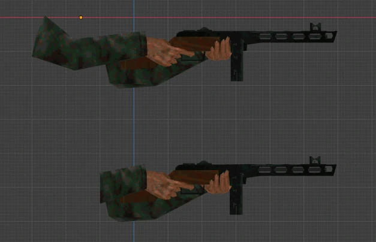
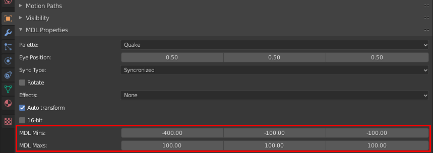
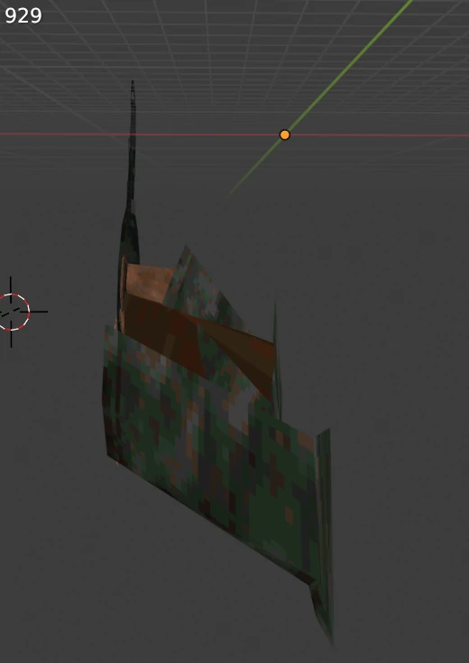
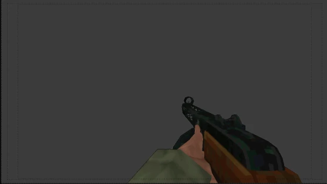

For more information about the vanilla plugin features, check out the original [io_mesh_qfmdl](https://github.com/robrohan/blender_ie_quake_mdl) Blender MDL plugin.

## Demo

## Usage

This plugin modification adds 2 extra 3D Vector settings to Object Properties. These vectors define a rectangular bounding box that forms around the mesh. Upon export, any vertices that are set to leave these bounds will instead cling to the edge, mitigating vertex swimming as a result of a large difference in position per vertex per frame.

These bounding vector points are relative to the 3D Grid in the Blender view, and are in no way correlated to Quake client-view positioning. This makes the Grid a beneficial tool for determining the points used to form your bounding box.

<i>Example of vertices reaching the end of their bounding box</i>
 
 
 

## Export Example

It is important to note this feature may only be valuable in very niche viewmodel cases, as projects that allow Field of View customization are likely to have the effect of the animation continuing off-camera broken by the end user.